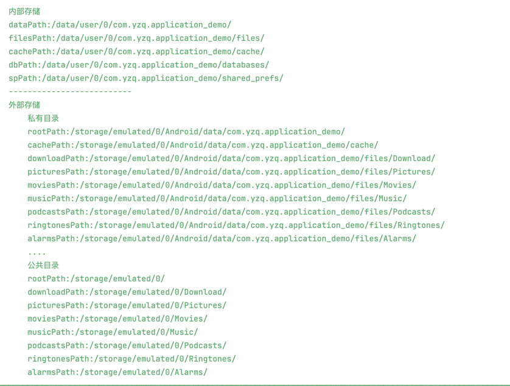

# Application 组件

[](https://search.maven.org/artifact/com.xeonyu/application)
[](https://android-arsenal.com/api?level=21)
[](LICENSE)

一个简单易用、无侵入的 Android Application 组件库，提供应用生命周期管理、状态监听、存储管理等功能。

## 功能特点

- 🚀 轻量级，零侵入性
- 📱 完整的应用生命周期管理
- 🔄 前后台状态自动监听
- 📂 结构化的存储路径管理
- 🛠 丰富的应用工具方法
- ⚡ 支持多进程

## 开始使用

### 1. 添加依赖

```kotlin
dependencies {
    implementation("com.xeonyu:application:1.0.7")
}
```

### 2. 初始化

在你的 Application 类中：

```kotlin
class YourApp : Application() {
    override fun onCreate() {
        super.onCreate()
        AppManager.init(this)
        // 可选：开启调试模式
        // AppManager.init(this, debug = true)
    }
}
```

## 核心功能

### 1. 应用状态监听

```kotlin
AppManager.addAppStateListener(object : AppStateListener {
    override fun onAppForeground() {
        // 应用切换到前台
    }
    
    override fun onAppBackground() {
        // 应用切换到后台
    }
    
    override fun onAppExit() {
        // 应用退出
    }
})
```

### 2. Activity 管理

```kotlin
// 获取栈顶 Activity
val topActivity = AppManager.topActivity

// 获取 Activity 栈大小
val count = AppManager.activityCount

// 退出应用
AppManager.exitApp()
```

### 3. 进程信息

```kotlin
// 判断是否是主进程
val isMain = AppManager.isMainProcess()

// 获取当前进程名
val processName = AppManager.getCurrentProcessName()

// 获取应用包名
val packageName = AppManager.getPackageName()
```

### 4. 存储路径管理

#### 内部存储

```kotlin
// 内部存储路径
val dataPath = AppStorage.Internal.dataPath
val filesPath = AppStorage.Internal.filesPath
val cachePath = AppStorage.Internal.cachePath
val dbPath = AppStorage.Internal.dbPath
```

#### 外部存储

```kotlin
// 私有目录（无需权限）
val privateFiles = AppStorage.External.Private.filesPath
val privateCache = AppStorage.External.Private.cachePath

// 公共目录（需要权限）
val publicDownload = AppStorage.External.Public.downloadPath
val publicPictures = AppStorage.External.Public.picturesPath
```

## API 参考

### AppManager API

| 类别 | API | 描述 |
|-----|-----|------|
| 初始化 | `init(application: Application, debug: Boolean = false)` | 初始化 AppManager |
| 状态 | `isForeground: Boolean` | 应用是否在前台 |
| Activity | `topActivity: Activity?` | 获取栈顶 Activity |
| | `activityCount: Int` | Activity 栈大小 |
| | `exitApp()` | 退出应用 |
| 进程 | `isMainProcess()` | 是否是主进程 |
| | `getCurrentProcessName()` | 获取进程名 |
| | `getPackageName()` | 获取包名 |
| 生命周期 | `addActivityLifecycleCallbacks()` | 添加 Activity 生命周期回调 |
| | `removeActivityLifecycleCallbacks()` | 移除生命周期回调 |
| 状态监听 | `addAppStateListener()` | 添加应用状态监听 |
| | `removeAppStateListener()` | 移除状态监听 |
| | `clearAppStateListener()` | 清除所有状态监听 |

### AppStorage API

| 类别 | 路径 | 描述 |
|-----|------|------|
| Internal | `dataPath` | 应用数据目录 |
| | `filesPath` | 文件目录 |
| | `cachePath` | 缓存目录 |
| | `dbPath` | 数据库目录 |
| | `spPath` | SharedPreferences 目录 |
| External.Private | `rootPath` | 外部私有根目录 |
| | `filesPath` | 外部私有文件目录 |
| | `cachePath` | 外部私有缓存目录 |
| External.Public | `downloadPath` | 公共下载目录 |
| | `picturesPath` | 公共图片目录 |
| | `musicPath` | 公共音乐目录 |
| | `moviesPath` | 公共视频目录 |

## 注意事项

1. 外部公共目录访问需要相应的存储权限
2. Android 10 (API 29) 及以上版本使用分区存储
3. 建议在 Application 的 onCreate 中尽早初始化

## 许可证

```
Copyright 2024 XeonYu

Licensed under the Apache License, Version 2.0 (the "License");
you may not use this file except in compliance with the License.
You may obtain a copy of the License at

    http://www.apache.org/licenses/LICENSE-2.0

Unless required by applicable law or agreed to in writing, software
distributed under the License is distributed on an "AS IS" BASIS,
WITHOUT WARRANTIES OR CONDITIONS OF ANY KIND, either express or implied.
See the License for the specific language governing permissions and
limitations under the License.
```

# AppManager 模块

## 概述

`AppManager` 模块管理应用的生命周期和状态，提供了便捷的方法来处理应用的初始化、前后台状态监听、应用退出、进程信息获取等功能。

## 特性

- **应用初始化**：初始化应用并设置调试模式。
- **前后台状态监听**：监听应用的前后台状态变化。
- **Activity 栈管理**：管理 Activity 栈，提供获取栈顶 Activity、Activity 数量等功能。
- **进程信息获取**：获取当前进程名称和信息。
- **应用状态监听**：添加、移除和清除应用状态监听器。
- **安装应用**：提供应用安装方法。
- **应用是否安装检查**：检查应用是否已安装。

## 使用方法

### 在你的Application类中初始化

```kotlin
AppManager.init(this)
```

#### 全局的Application上下文

注意包名：

```
import com.yzq.application.AppContext
//示例 ApplicationContext
AppContext.checkSelfPermission( android.Manifest.permission.WRITE_EXTERNAL_STORAGE)
//示例 Application
Utils.init(AppManager.application)
```

#### App状态监听

```kotlin
AppManager.addAppStateListener(object : AppStateListener {

    override fun onAppForeground() {
        /*App切换到前台*/
    }

    override fun onAppExit() {
        /*App 退出*/
    }

    override fun onAppBackground() {
        /*App切换到后台*/
    }
})
```

## API 详细说明

### 初始化方法

| 方法签名                                                         | 描述                            |
|--------------------------------------------------------------|-------------------------------|
| `fun init(application: Application, debug: Boolean = false)` | 初始化 `AppManager`，设置应用上下文和调试模式 |

### 前后台状态

| 属性                          | 描述        |
|-----------------------------|-----------|
| `val isForeground: Boolean` | 获取应用是否在前台 |

### Activity 栈管理

| 方法/属性                        | 描述                 |
|------------------------------|--------------------|
| `val topActivity: Activity?` | 获取栈顶的 Activity     |
| `val activityCount: Int`     | 获取当前 Activity 栈的大小 |
| `fun exitApp()`              | 退出应用，结束所有 Activity |

### 进程信息

| 方法                                    | 描述           |
|---------------------------------------|--------------|
| `fun isMainProcess(): Boolean`        | 判断当前进程是否是主进程 |
| `fun getCurrentProcessName(): String` | 获取当前进程名      |
| `fun getPackageName(): String`        | 获取应用包名       |

### Activity生命周期管理

| 方法                                                                                   | 描述                                                         |
|--------------------------------------------------------------------------------------|------------------------------------------------------------|
| `fun addActivityLifecycleCallbacks(callbacks: DefaultActivityLifecycleCallbacks)`    | 添加 Activity 生命周期回调，注册给定的回调函数以接收全局 Activity 生命周期事件          | | 描述                                                         |
| `fun removeActivityLifecycleCallbacks(callbacks: DefaultActivityLifecycleCallbacks)` | 移除之前添加的 Activity 生命周期回调，取消注册指定的回调函数，不再接收全局 Activity 生命周期事件 |

### 应用状态监听

| 方法                                                               | 描述          |
|------------------------------------------------------------------|-------------|
| `fun addAppStateListener(appStateListener: AppStateListener)`    | 添加应用状态监听器   |
| `fun removeAppStateListener(appStateListener: AppStateListener)` | 移除应用状态监听器   |
| `fun clearAppStateListener()`                                    | 清除所有应用状态监听器 |

### 应用安装

| 方法                                                 | 描述        |
|----------------------------------------------------|-----------|
| `fun isAppInstalled(packageName: String): Boolean` | 判断应用是否已安装 |
| `fun installApk(apkPath: String)`                  | 安装 APK 文件 |

---

## AppStorage 模块

## 概述

`AppStorage` 模块提供了一种结构化的方法来管理 Android 应用中的内部和外部存储。该模块封装了各种存储目录的路径，确保兼容性和易用性，尤其是在
Android 10 及以后的版本中。

## 特性

- **内部存储路径**：提供内部存储位置的路径，这些路径不需要任何特殊权限，并且是应用私有的。
- **外部存储路径**：区分外部存储中的私有目录和公共目录，外部私有目录无需申请权限，应用卸载时会被删除，而外部公共目录需要申请权限，应用卸载时不会被删除。

## 内部存储

内部存储用于存放应用的私有数据，包括：

- **数据路径**：通用数据目录。
- **文件路径**：应用创建的文件目录。
- **共享偏好路径**：共享偏好目录。
- **缓存路径**：缓存文件目录。
- **数据库路径**：SQLite 数据库文件目录。
- **代码缓存路径**：代码缓存文件目录。

### 路径详情

| 名称            | 路径                                          |
|---------------|---------------------------------------------|
| dataPath      | `/data/user/0/<package_name>/`              |
| filesPath     | `/data/user/0/<package_name>/files/`        |
| spPath        | `/data/user/0/<package_name>/shared_prefs/` |
| cachePath     | `/data/user/0/<package_name>/cache/`        |
| dbPath        | `/data/user/0/<package_name>/databases/`    |
| codeCachePath | `/data/user/0/<package_name>/code_cache/`   |

## 外部存储

外部存储分为私有目录和公共目录。

### 私有目录

外部存储中的私有目录不需要特殊权限，在应用卸载时会被删除。

#### 路径详情

| 名称            | 路径                                                                 |
|---------------|--------------------------------------------------------------------|
| rootPath      | `/storage/emulated/0/Android/data/<package_name>/`                 |
| cachePath     | `/storage/emulated/0/Android/data/<package_name>/cache/`           |
| filesPath     | `/storage/emulated/0/Android/data/<package_name>/files/`           |
| downloadPath  | `/storage/emulated/0/Android/data/<package_name>/files/Download/`  |
| picturesPath  | `/storage/emulated/0/Android/data/<package_name>/files/Pictures/`  |
| moviesPath    | `/storage/emulated/0/Android/data/<package_name>/files/Movies/`    |
| musicPath     | `/storage/emulated/0/Android/data/<package_name>/files/Music/`     |
| podcastsPath  | `/storage/emulated/0/Android/data/<package_name>/files/Podcasts/`  |
| ringtonesPath | `/storage/emulated/0/Android/data/<package_name>/files/Ringtones/` |
| alarmsPath    | `/storage/emulated/0/Android/data/<package_name>/files/Alarms/`    |

### 公共目录

公共目录需要读写权限，应用卸载时不会被删除，通常用于存放与应用生命周期无关的数据。

#### 路径详情

| 名称            | 路径                               |
|---------------|----------------------------------|
| rootPath      | `/storage/emulated/0/`           |
| downloadPath  | `/storage/emulated/0/Download/`  |
| picturesPath  | `/storage/emulated/0/Pictures/`  |
| moviesPath    | `/storage/emulated/0/Movies/`    |
| musicPath     | `/storage/emulated/0/Music/`     |
| podcastsPath  | `/storage/emulated/0/Podcasts/`  |
| ringtonesPath | `/storage/emulated/0/Ringtones/` |
| alarmsPath    | `/storage/emulated/0/Alarms/`    |

## 使用方法

在应用代码中，只需引用 `AppStorage` 模块中定义的路径即可。
路径定义为 `AppStorage` 对象及其嵌套对象 (`Internal`, `External.Private`, `External.Public`) 的属性。

### 示例

```kotlin
val internalDataPath = AppStorage.Internal.dataPath
val externalFilesPath = AppStorage.External.Private.filesPath
val publicDownloadPath = AppStorage.External.Public.downloadPath

// 路径信息
AppStorage.logPathInfo

```




